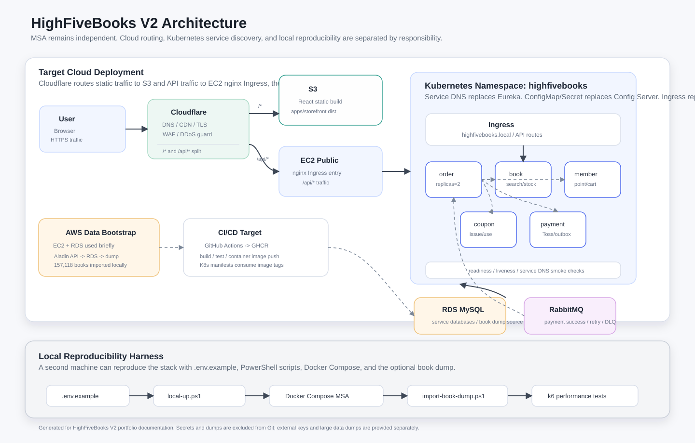
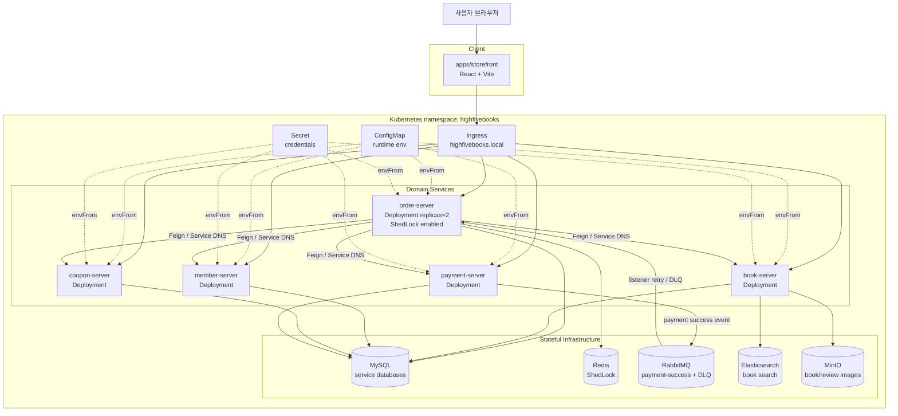
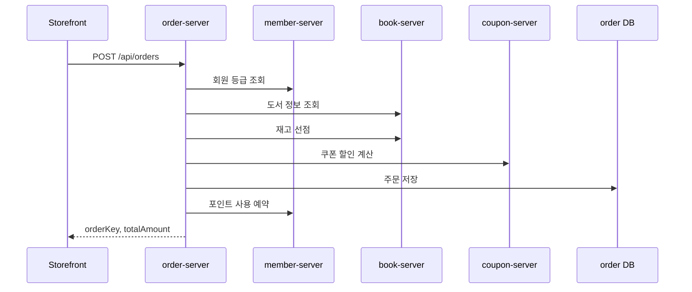
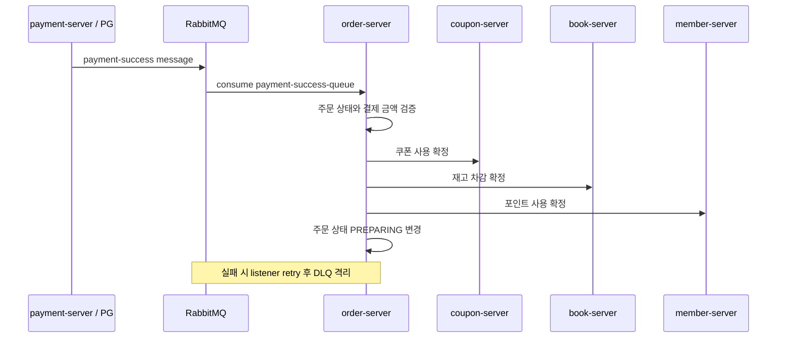

<div align="center">

# HighFiveBooks V2

**기존 HighFiveBooks MSA를 유지하면서 주문 도메인 안정성과 Kubernetes 전환 근거를 보강한 리팩토링 프로젝트**


</div>

---

## 목차

- [프로젝트 소개](#프로젝트-소개)
- [핵심 리팩토링](#핵심-리팩토링)
- [기술 스택](#기술-스택)
- [배포 구조](#배포-구조)
- [주문 처리 흐름](#주문-처리-흐름)
- [저장소 구조](#저장소-구조)
- [로컬 실행](#로컬-실행)
- [검증](#검증)
- [Kubernetes 전환](#kubernetes-전환)
- [문서](#문서)
- [면접 포인트](#면접-포인트)

---

## 프로젝트 소개

HighFiveBooks는 도서 탐색, 장바구니, 주문, 결제, 쿠폰, 포인트를 포함한 온라인 서점 서비스입니다.
V2는 기존 팀 프로젝트를 개인 포트폴리오 관점에서 다시 정리한 저장소이며, 단순히 코드를 한 저장소에 모으는 것이 아니라 **MSA 구조를 유지한 채 운영 안정성 이슈를 선별해 리팩토링**하는 데 초점을 두었습니다.

핵심 방향은 다음과 같습니다.

- `order-server`를 중심으로 주문, 결제, 재고, 쿠폰, 포인트 경계를 정리
- Eureka, Config Server, Gateway 의존을 Kubernetes Service DNS, ConfigMap/Secret, Ingress로 대체
- 결제 성공 메시지의 Retry/DLQ, 스케줄러 중복 실행 방지, Feign 장애 격리 정책 보강
- 기존 Thymeleaf `front_server`는 직접 고치지 않고 React/Vite `apps/storefront`로 대체

> monorepo는 리팩토링 관리 방식일 뿐이고, 각 도메인 서버는 독립 실행/독립 배포 가능한 MSA로 유지합니다.

---

## 핵심 리팩토링

| 영역 | 개선 내용 |
|---|---|
| 주문 트랜잭션 경계 | 외부 Feign/Rabbit I/O와 DB 상태 변경을 분리하고, DB mutation 전담 서비스에 명시적 트랜잭션 적용 |
| Feign 경계 테스트 | JDK `HttpServer` 기반 boundary test로 request path/header/body와 retry 경계 검증 |
| RabbitMQ 안정화 | `payment-success-queue`에 Retry backoff와 DLQ를 적용해 poison message 무한 재소비 방지 |
| Scheduler Lock | Redis 기반 ShedLock으로 order-server replica 2개 이상에서 자동 취소/구매 확정 중복 실행 방지 |
| Feign 장애 격리 | 기본 retry를 `Retryer.NEVER_RETRY`로 비활성화하고 timeout/CircuitBreaker를 명시 |
| K8s 전환 | Service DNS, ConfigMap/Secret, Ingress, liveness/readiness probe, smoke script 정리 |
| Storefront 결제 | Toss Payments client key가 있으면 실제 결제창, 없으면 demo pseudo 결제로 fallback |

---

## 기술 스택

| 영역 | 기술 |
|---|---|
| Backend | Java 21, Spring Boot 3.5.7, Spring Cloud OpenFeign, Resilience4j, ShedLock, Spring Data JPA, Spring AMQP |
| Frontend | React 19, TypeScript 5.7, Vite 6, React Router 7, Tailwind CSS 4, Axios, Framer Motion |
| Data / Messaging | MySQL 8.4, Redis 7.2, RabbitMQ 3.13, Elasticsearch, MinIO |
| Infra / DevOps | Docker Compose, Kubernetes, Kustomize, Argo CD, Argo Rollouts, GitHub Actions |
| Payment | Toss Payments 연동 후보 + demo pseudo payment fallback |

---

## 배포 구조





### Spring Cloud 대체 매핑

| 기존 구성 | V2 구성 |
|---|---|
| Eureka | Kubernetes Service DNS |
| Config Server | ConfigMap / Secret |
| Gateway | Ingress |
| Thymeleaf `front_server` | React `apps/storefront` |

---

## 주문 처리 흐름

### 주문 생성



### 결제 성공 메시지 처리



---

## 저장소 구조

```text
HighFivebooks-V2/
  apps/
    storefront/          React/Vite 사용자 쇼핑몰 프론트

  services/
    order-server/        메인 리팩토링 대상
    book-server/         도서, 검색, 재고, 이미지
    member-server/       회원, 등급, 포인트, 장바구니
    coupon-server/       쿠폰 계산, 사용, 취소
    payment-server/      결제 확인, 결제 성공 이벤트

  k8s/
    base/                Deployment, Service, ConfigMap, Secret, Ingress
    rollouts/            Argo Rollouts 실험
    gitops/              Argo CD Application

  docs/                  분석, 근거, runbook 문서
  scripts/               K8s smoke check
  docker-compose.yml     로컬 인프라 + apps 프로파일
```

---

## 로컬 실행

### 환경 변수 준비

```powershell
copy .env.example .env
```

### 인프라 실행

```powershell
docker compose up -d mysql rabbitmq redis elasticsearch minio
```

| 구성 요소 | 기본 접속 |
|---|---|
| MySQL | `localhost:3307` |
| RabbitMQ | `localhost:5672` |
| RabbitMQ UI | `http://localhost:15672` |
| Redis | `localhost:6380` |

### 전체 앱 프로파일 실행

각 서비스 jar 빌드 후 Docker Compose apps 프로파일로 실행합니다.

```powershell
docker compose --profile apps up -d --build
```

서비스 포트:

```text
member-server   9001
book-server     9002
coupon-server   9004
payment-server  9005
order-server    9006
```

### Storefront

```powershell
cd apps/storefront
npm ci
npm run dev
npm run build
```

주요 환경 변수:

```text
VITE_API_ADAPTER=mock
VITE_API_BASE_URL=http://localhost:8080
VITE_TOSS_CLIENT_KEY=
```

`VITE_TOSS_CLIENT_KEY`가 비어 있으면 demo pseudo payment로 동작하고, 값이 있으면 Toss Payments 결제창을 호출합니다.

---

## 검증

### order-server

```powershell
cd services/order-server
.\mvnw.cmd test
```

현재 기준:

```text
126 tests, 0 failures, 0 errors, 0 skipped
```

### K8s manifest

```powershell
kubectl kustomize k8s/base
```

### K8s smoke check

```powershell
powershell -ExecutionPolicy Bypass -File .\scripts\k8s-smoke.ps1
```

현재 로컬 환경에서는 Kubernetes context와 kind가 없어 실제 smoke 완료까지는 수행하지 못했고, 그 기록은 `docs/k8s-smoke-evidence.md`에 남겼습니다.

### Storefront

```powershell
cd apps/storefront
npm run build
```

현재 Codex 실행 환경에서는 pnpm의 `esbuild` build script 승인 단계와 권한 제한 때문에 최종 build 검증이 보류되었습니다. 코드 정적 확인과 깨진 문자열 정리는 완료했습니다.

---

## Kubernetes 전환

`k8s/base`는 아래 구성 요소를 포함합니다.

- namespace
- ConfigMap / Secret
- MySQL, Redis, RabbitMQ, Elasticsearch, MinIO StatefulSet
- book/member/coupon/payment/order Deployment
- Service
- Ingress
- liveness/readiness probe

order-server는 replica 2개를 기준으로 두고, Redis ShedLock으로 스케줄러 중복 실행을 방어합니다.

---

## 문서

| 문서 | 내용 |
|---|---|
| [order-flow-boundary-map.md](docs/order-flow-boundary-map.md) | 주문 흐름과 Feign 경계 |
| [order-resilience-evidence.md](docs/order-resilience-evidence.md) | 트랜잭션, DLQ, ShedLock, Feign 장애 격리 근거 |
| [k8s-transition-runbook.md](docs/k8s-transition-runbook.md) | K8s 전환 실행 절차 |
| [k8s-smoke-evidence.md](docs/k8s-smoke-evidence.md) | K8s smoke check 기록 |
| [runtime-config.md](docs/runtime-config.md) | local/prod 런타임 설정 |
| [LOCAL_REPRODUCIBILITY.md](docs/LOCAL_REPRODUCIBILITY.md) | 다른 컴퓨터에서 로컬 통합 환경 재현 절차 |
| [STOREFRONT_API_CONTRACT.md](docs/STOREFRONT_API_CONTRACT.md) | storefront API 계약 |

---

## 면접 포인트

**Q. 왜 MSA를 유지했나요?**
이 프로젝트의 목적은 기능을 단순히 한 프로세스로 합치는 것이 아니라, 기존 MSA에서 발생할 수 있는 운영 문제를 드러내고 개선하는 것입니다. 모놀리스로 합치면 Feign 장애 격리, 메시지 Retry/DLQ, 분산 보상, 멀티 인스턴스 스케줄러 같은 학습 포인트가 사라지기 때문에 MSA를 유지했습니다.

**Q. 주문 도메인에서 무엇을 개선했나요?**
주문은 결제, 재고, 쿠폰, 포인트 상태 변경을 조율합니다. 그래서 DB 트랜잭션과 외부 I/O를 분리하고, 상태 변경 Feign 호출의 암묵적 retry를 끄고, 결제 성공 이벤트는 RabbitMQ Retry/DLQ로 격리했습니다. 또한 order-server를 여러 Pod로 배포해도 스케줄러가 중복 실행되지 않도록 Redis ShedLock을 적용했습니다.

**Q. Spring Cloud 구성은 어떻게 바꿨나요?**
Eureka는 Kubernetes Service DNS, Config Server는 ConfigMap/Secret, Gateway는 Ingress로 대체했습니다. 별도 운영 서버를 줄이고 Kubernetes 표준 리소스로 런타임 설정, 서비스 발견, 라우팅을 구성했습니다.

**Q. 결제 연동은 어떻게 처리했나요?**
storefront는 `VITE_TOSS_CLIENT_KEY`가 있으면 Toss Payments 결제창을 호출하고, 성공 시 `/payment/success`에서 백엔드 결제 승인 API를 호출합니다. 키가 없으면 로컬 개발을 위해 demo pseudo payment로 fallback합니다.
