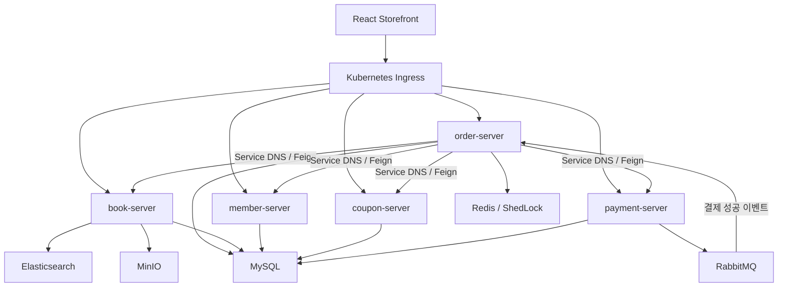
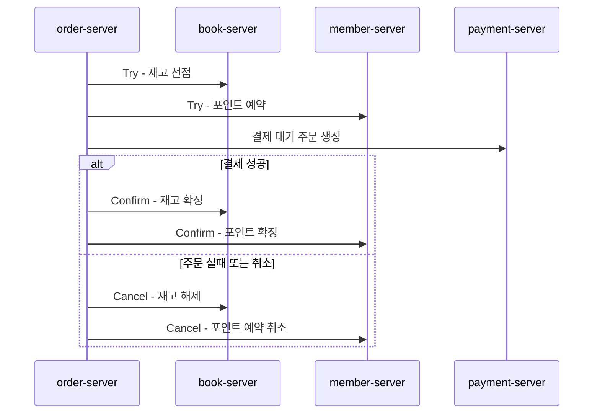
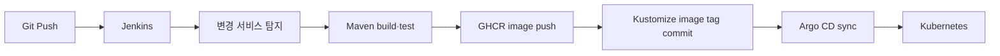

<div align="center">

# HighFiveBooks V2

**주문 정합성과 Kubernetes 운영 전환을 중심으로 리팩터링한 MSA 온라인 서점**


</div>

HighFiveBooks는 도서 검색, 장바구니, 주문, 결제, 쿠폰, 포인트를 제공하는 온라인 서점입니다. V2에서는 첫 MSA 프로젝트에서 겪은 분산 정합성·장애 전파·배포 복잡도를 다시 검토하고, 주문 도메인의 안전성과 Kubernetes 기반 운영 구조를 집중적으로 개선했습니다.

## 핵심 결과

| 영역 | 결과 | 근거 |
|---|---|---|
| 도서 조회 | k6 p95 `9,039.51ms → 51.97ms`, 약 174배 개선 | 동일 스크립트의 [baseline](perf/results/book-read-baseline-20260708-234828.json)·[optimized](perf/results/book-read-optimized-20260708-235147.json) 원본 결과 |
| 주문 정합성 | 재고·포인트를 Try/Confirm/Cancel로 예약하고 실패 시 명시적 보상 | TCC adapter, 주문 서비스, boundary test |
| 메시지 장애 | 결제 성공 이벤트에 Retry backoff와 DLQ 적용 | RabbitMQ 설정·테스트 |
| 다중 인스턴스 | Redis ShedLock으로 주문 스케줄러 중복 실행 방지 | scheduler 설정·테스트 |
| K8s 전환 | kind에서 인프라와 5개 서비스 rollout, Service 연결, readiness 응답 확인 | [2026-07-12 스모크 기록](docs/k8s-smoke-evidence.md) |
| GitOps | Jenkins가 빌드·테스트·이미지·태그 갱신, Argo CD가 배포 담당 | `Jenkinsfile`, `k8s/gitops` |

## V1에서 V2로

| V1 | V2 | 전환 이유 |
|---|---|---|
| Eureka | Kubernetes Service DNS | 서비스 발견을 플랫폼 표준 기능으로 통합 |
| Config Server | ConfigMap·Secret | 별도 설정 서버 의존을 줄이고 배포 선언과 런타임 설정을 함께 관리 |
| Spring Cloud Gateway | Ingress | 클러스터 진입점과 서비스 라우팅을 Kubernetes 리소스로 표현 |
| 서비스별 저장소 | 리팩터링 monorepo | 여러 서비스와 인프라 변경을 한 흐름에서 검증하되 독립 실행·배포 경계는 유지 |
| Thymeleaf 프론트 | React 19·Vite | API 계약 중심의 프론트엔드로 분리하고 사용자 흐름을 재구성 |
| 수동 배포 중심 | Jenkins CI + Argo CD GitOps | 빌드와 배포 책임을 분리하고 선언된 이미지 변경을 기준으로 배포하기 위해 적용 |

Kubernetes와 GitOps는 단순히 이력서에 기술을 추가하기 위한 교체가 아니라, V1에서 운영해야 했던 Eureka·Config Server·Gateway 역할을 플랫폼 기능과 선언형 배포로 옮겨 보고 싶어 적용했습니다.

## 서비스 구조



## 주요 설계 결정

### 1. TCC 기반 분산 트랜잭션 정합성

주문 생성 시 재고와 포인트를 먼저 예약(Try)하고 결제 성공 후 확정(Confirm), 주문 실패·취소 시 해제(Cancel)합니다. 첫 MSA에서 XA나 Saga 오케스트레이터까지 한 번에 도입하면 러닝커브와 구현·운영 난도가 크게 높아진다고 판단했습니다. 그래서 각 도메인의 상태 전이를 API로 명확히 표현하고 기존 동기 호출 흐름에 적용하기 쉬운 TCC와 명시적 보상을 선택했습니다.

이 선택은 모든 실패를 자동으로 해결한다는 뜻이 아닙니다. 외부 호출과 로컬 DB 트랜잭션을 분리하고 Feign 암묵적 retry를 끄며, 실패 경로에서 보상 호출을 드러내는 범위까지 구현했습니다. 보상 호출 자체의 실패를 영속화해 재처리하는 구조는 후속 과제입니다.



### 2. 트랜잭션과 외부 I/O 경계 분리

Feign·RabbitMQ 호출이 DB 트랜잭션을 오래 점유하지 않도록 오케스트레이션과 mutation 서비스를 분리했습니다. DB 상태 변경 메서드만 명시적으로 트랜잭션을 사용하고, 외부 상태 변경 호출은 `Retryer.NEVER_RETRY`, timeout, CircuitBreaker와 도메인 보상 흐름으로 제어합니다.

### 3. 이벤트 실패를 Retry와 DLQ로 격리

결제 성공 리스너가 예외를 삼키지 않도록 하고 제한된 backoff 재시도 후 DLQ로 이동시킵니다. poison message가 같은 큐에서 무한 반복되지 않으며 실패 이벤트를 별도로 확인할 수 있습니다.

### 4. 조회 성능을 원본 결과로 관리

도서 목록과 상세 조회 부하를 동시에 발생시키는 동일 k6 스크립트로 변경 전후를 측정했습니다. 10 VU 목록 조회와 10 VU 상세 조회, `size=1` 조건의 raw JSON을 저장해 개선 수치와 실행 조건을 함께 추적합니다.

## CI/CD와 GitOps



- Jenkins는 변경된 서비스의 빌드·테스트, GHCR 이미지 push, `k8s/base/kustomization.yaml` 이미지 태그 갱신을 담당합니다.
- Argo CD는 Git의 선언 상태를 클러스터에 동기화하며 Jenkins에서 `kubectl apply`를 실행하지 않습니다.
- `k8s/base`는 현재 검증한 기본 Deployment 구성입니다.
- `k8s/rollouts`에는 20% → 60초 → 50% → 60초 → 100%의 시간 기반 canary가 있습니다. AnalysisTemplate이나 메트릭 기반 자동 판정은 아직 없으므로 운영 성과로 과장하지 않습니다.

## Kubernetes 검증 상태

2026-07-12 Windows·Docker 27.1.1·kind `highfivebooks` 환경에서 `scripts/k8s-smoke.ps1`을 실행해 다음을 확인했습니다.

- namespace와 MySQL·Redis·RabbitMQ·Elasticsearch·MinIO StatefulSet rollout
- book·member·coupon·payment·order Deployment rollout
- 5개 서비스 EndpointSlice 주소와 order-server의 Service DNS 설정
- order-server의 MySQL·RabbitMQ 연결 로그
- Elasticsearch Nori 플러그인과 한국어 analyzer 동작
- 5개 서비스 readiness endpoint HTTP 200

이는 `k8s/base` Deployment의 로컬 kind 스모크 성공 근거입니다. Argo CD 동기화와 Argo Rollouts canary를 운영 클러스터에서 실행했다는 근거와는 구분합니다.

## 기술 스택

| 영역 | 기술 |
|---|---|
| Backend | Java 21, Spring Boot 3.5.7, Spring Cloud OpenFeign, Resilience4j, Spring Data JPA |
| Frontend | React 19, TypeScript, Vite, TanStack Query, Tailwind CSS |
| Data·Messaging | MySQL 8.4, Redis 7.2, RabbitMQ 3.13, Elasticsearch, MinIO |
| Infra | Docker Compose, Kubernetes, kind, Kustomize, Nginx Ingress |
| CI/CD | Jenkins, GHCR, Argo CD, Argo Rollouts |
| Test | JUnit 5, Mockito, JDK HttpServer boundary test, k6 |

## 로컬 실행

### Docker Compose

```powershell
Copy-Item .env.example .env
docker compose up -d mysql rabbitmq redis elasticsearch minio
docker compose --profile apps up -d --build
```

기본 서비스 포트는 member `9001`, book `9002`, coupon `9004`, payment `9005`, order `9006`입니다.

### order-server 테스트

```powershell
Set-Location services/order-server
.\mvnw.cmd test
```

### Storefront

```powershell
Set-Location apps/storefront
npm ci
npm run dev
```

`VITE_TOSS_CLIENT_KEY`가 없으면 로컬 확인용 pseudo payment를 사용하고, 키가 있으면 Toss Payments 결제창을 호출합니다.

### Kubernetes 스모크

```powershell
kubectl apply -k k8s/base
powershell -ExecutionPolicy Bypass -File .\scripts\k8s-smoke.ps1
```

전체 재현 순서는 [로컬 재현 문서](docs/LOCAL_REPRODUCIBILITY.md)와 [K8s 전환 runbook](docs/k8s-transition-runbook.md)을 참고합니다.

## 저장소 구조

```text
HighFivebooks-V2/
├─ apps/storefront/       React 사용자 화면
├─ services/              5개 도메인 Spring Boot 서비스
├─ k8s/base/              kind에서 검증한 기본 리소스
├─ k8s/rollouts/          시간 기반 Argo Rollouts canary
├─ k8s/gitops/            Argo CD Application
├─ perf/                  k6 스크립트와 원본 결과
├─ scripts/               K8s 스모크 자동 점검
├─ docs/                  설계 근거와 재현 문서
└─ Jenkinsfile            변경 서비스 기반 CI·이미지·태그 갱신
```

## 근거 문서

| 문서 | 내용 |
|---|---|
| [order-flow-boundary-map.md](docs/order-flow-boundary-map.md) | 주문·결제·재고·포인트 경계 |
| [order-resilience-evidence.md](docs/order-resilience-evidence.md) | 트랜잭션, DLQ, ShedLock, Feign 정책 |
| [k8s-smoke-evidence.md](docs/k8s-smoke-evidence.md) | 2026-07-12 kind 실행 근거 |
| [ARGOCD_ROLLOUTS_RUNBOOK.md](docs/ARGOCD_ROLLOUTS_RUNBOOK.md) | Jenkins·Argo CD·Rollouts 책임과 절차 |
| [LOCAL_REPRODUCIBILITY.md](docs/LOCAL_REPRODUCIBILITY.md) | 로컬 통합 환경 재현 절차 |
| [STOREFRONT_API_CONTRACT.md](docs/STOREFRONT_API_CONTRACT.md) | Storefront API 계약 |

## 현재 한계

- TCC 보상 호출 자체가 실패한 경우를 영속화하고 자동 재처리하는 별도 보상 큐·상태 머신은 없습니다.
- 현재 로컬 스모크는 기본 Deployment 검증이며, Argo CD sync와 Rollout 승격·중단의 실제 실행 로그는 후속 증거가 필요합니다.
- canary는 시간 기반 단계 전환이며 Prometheus 지표 기반 자동 분석은 적용하지 않았습니다.
- Secret 예시는 개발용이므로 실제 환경에서는 External Secrets, Sealed Secrets 또는 클라우드 비밀 관리 서비스가 필요합니다.
